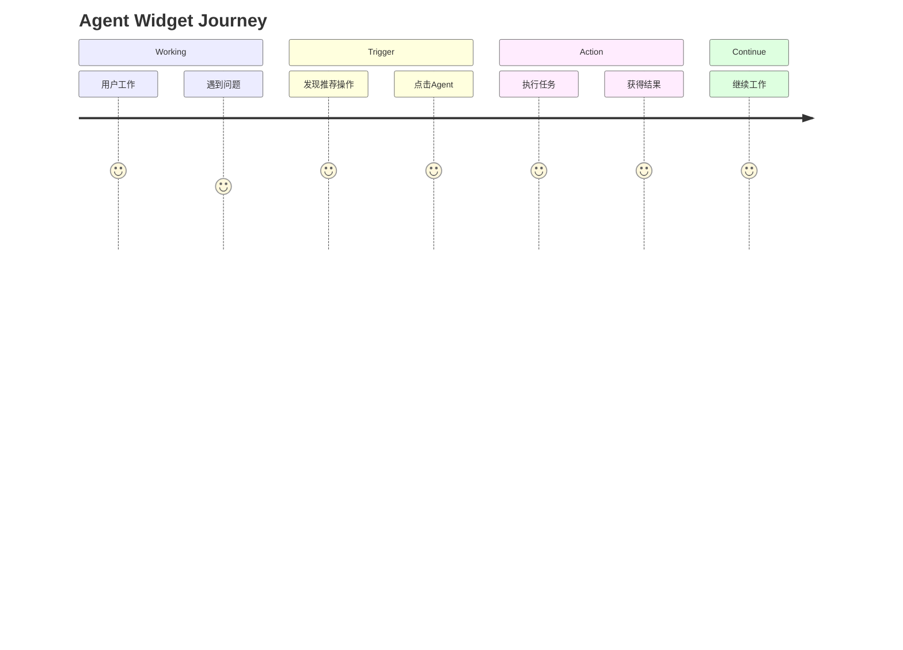
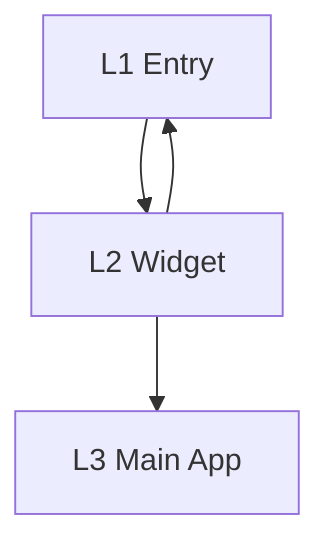
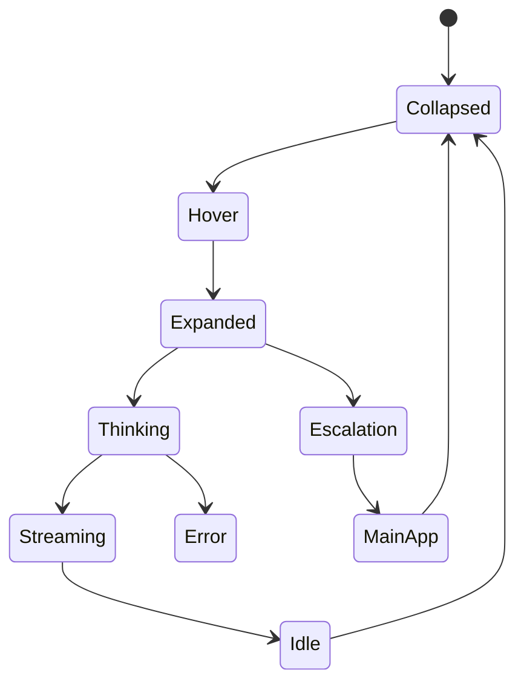
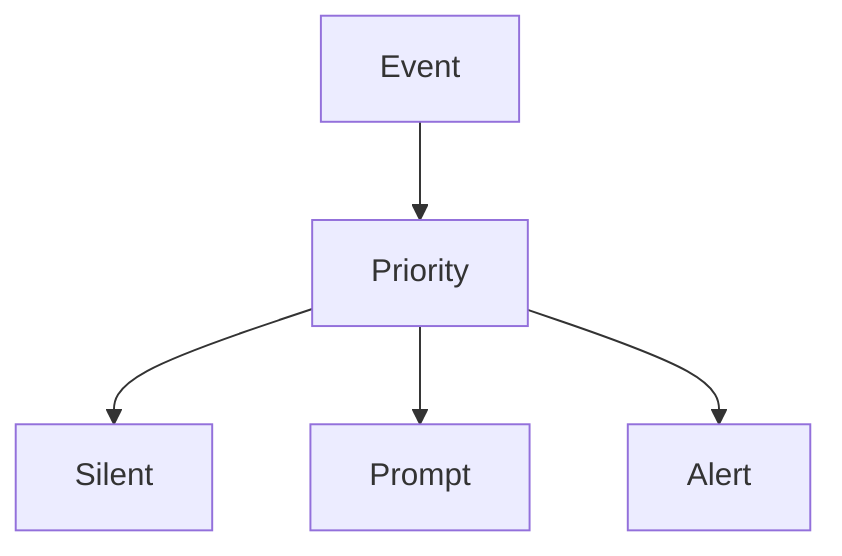
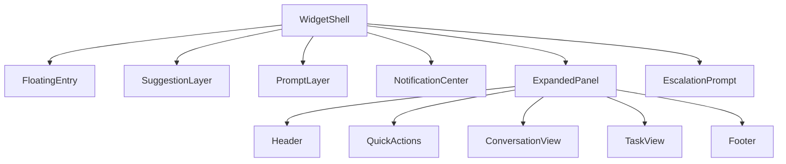

---

# Agent Widget UX Blueprint v1.0

## Vision

Agent Widget 是一个始终可达的 AI 工作入口。

目标：

* 不打断用户当前工作
* 用最少操作解决问题
* 优先完成任务而非聊天
* 超出能力边界时引导进入主应用

---

# UX Principles

## P1 · Instant Access

用户必须在 1 秒内打开 Agent。

支持：

* Click
* Hover
* Hotkey
* Notification

---

## P2 · Stay In Flow

用户不应离开当前工作流。

禁止：

* 强制跳转
* 强制全屏
* 阻塞操作

---

## P3 · Action First

优先展示操作。

不优先展示聊天框。

推荐：

```text
总结页面
翻译内容
提取待办
生成回复
```

---

## P4 · Escalation

复杂任务进入主应用。

Widget 只负责轻任务。

---

# User Journey



---

# Information Architecture



---

## Layer1

折叠态

职责：

* 存在感
* 通知
* 快速唤起

组件：

```text
Floating Entry
Badge
Notification Dot
```

---

## Layer2

展开态

职责：

* 快速解决问题

组件：

```text
Suggestion Layer
Quick Action
Conversation
Task View
```

---

## Layer3

主应用

职责：

* 长任务
* 多步骤任务
* 工作流

---

# Widget State Machine



---

# Trigger System

支持以下入口：

| Trigger          | Priority |
| ---------------- | -------- |
| Hover Suggestion | P0       |
| Click Widget     | P0       |
| Hotkey           | P0       |
| Notification     | P1       |
| Right Click      | P1       |
| Drag File        | P2       |

---

# Suggestion System

## Goal

降低用户思考成本。

---

## Hover Suggestion

```text
总结页面

解释选中内容

提取待办事项
```

---

## Context Suggestion

检测上下文。

### Email

```text
总结邮件

生成回复
```

---

### PDF

```text
总结文档

提取重点
```

---

### Meeting

```text
生成纪要

提取Action Item
```

---

# Right Click Menu

```text
打开助手

新建对话

────────

截图提问

翻译选中内容

识别当前页面

────────

设置

退出
```

---

# Notification System



---

## Silent

仅角标。

---

## Prompt

轻量提示。

```text
检测到邮件

[总结]
[回复]
```

---

## Alert

任务完成。

```text
报告已生成

[查看]
```

---

# Conversation System

## Message

```text
User

Assistant
```

---

## Streaming

```text
生成中...
```

---

## Error

```text
请求失败

[重试]
```

---

# Task System

支持：

```text
总结

翻译

解释

改写

提取待办

生成回复
```

---

状态：

```text
Pending

Running

Completed

Failed
```

---

# Escalation System

## Soft Escalation

```text
推荐在主应用继续完成

[继续]
```

---

## Hard Escalation

必须进入主应用。

例如：

```text
项目管理

工作流配置

复杂文档编辑
```

---

# Component Architecture



---

# Motion System

## Expand

```text
Scale 0.95 → 1
Duration 200ms
```

---

## Collapse

```text
Opacity → 0
Duration 150ms
```

---

## Suggestion

```text
Fade In
Slide Up
```

---

## Notification

```text
Spring
```

---

# Design Tokens

```yaml
widget-width: 360px

header-height: 48px

border-radius: 16px

padding: 12px

max-height: 80vh

shadow: large

blur: 20px
```

---

# Success Metrics

```text
Widget Open Rate

Suggestion Click Rate

Task Completion Rate

Escalation Rate

Return To Work Time
```

---

# Prototype Scope v1

必须实现：

```text
✓ Floating Entry

✓ Drag

✓ Snap

✓ Hover Suggestion

✓ Quick Actions

✓ Conversation

✓ Notification

✓ Escalation Prompt
```

非必须：

```text
✗ AI Backend

✗ User System

✗ Workflow Engine

✗ Database
```

---

这份 Blueprint 已经足够直接喂给 Cursor / Copilot：

```text
Blueprint.md
↓
生成单文件 HTML Prototype
↓
GSAP 动效
↓
React 组件拆分
```

属于一个比较完整、接近实际产品团队使用的 UX Blueprint。
