# Lumina Widget · UX 综合流程图

> 基于 [Agent Desktop Widget UX.md](Agent%20Desktop%20Widget%20UX.md) Final 版本生成  
> 覆盖：生命周期、用户触发、Agent 决策、Escalation、通知、专注模式、Spotlight Command Center

---

## 0. Spotlight Command Center 流程

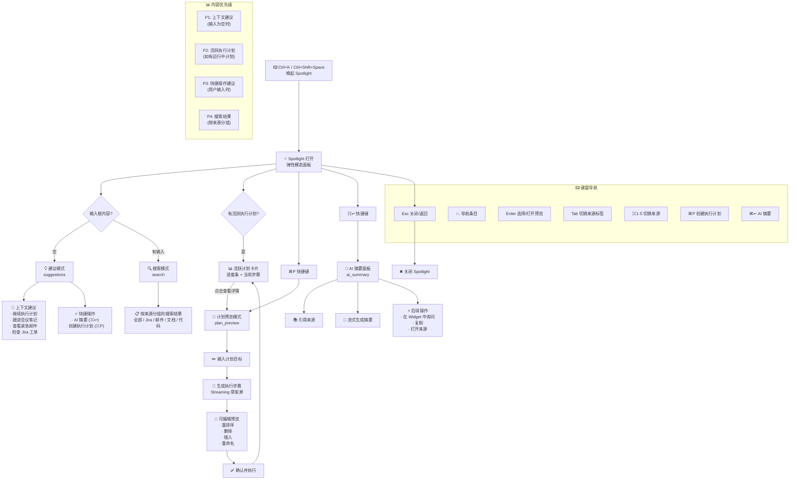

---

## 1. 系统总览

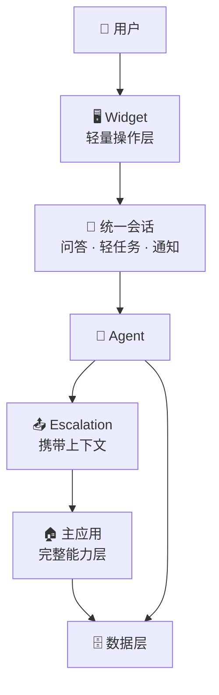

---

## 2. Widget 生命周期状态机

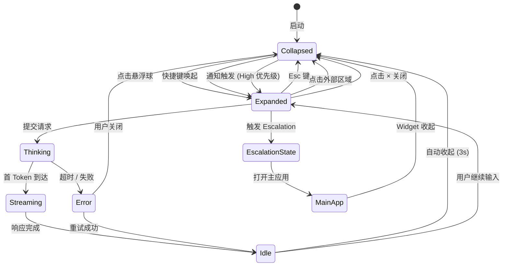

---

## 3. 折叠态 → 展开态触发路径

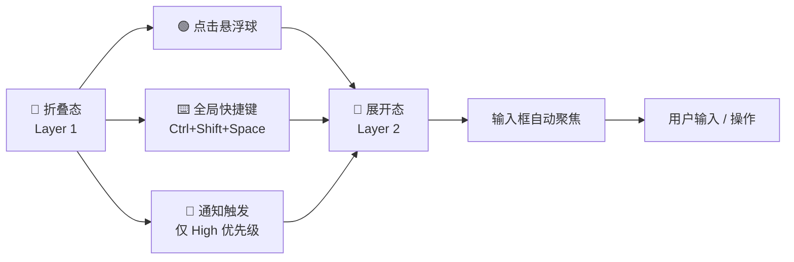

---

## 4. 展开态 → 收起态路径

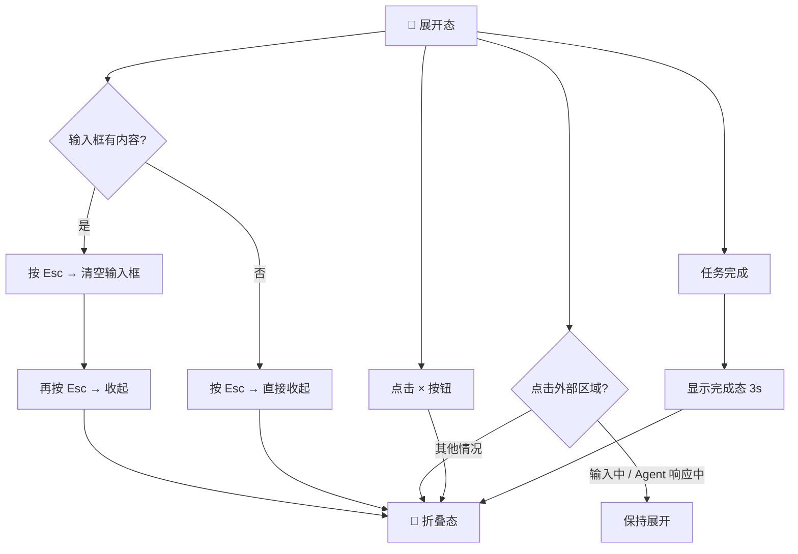

---

## 5. Agent 决策树

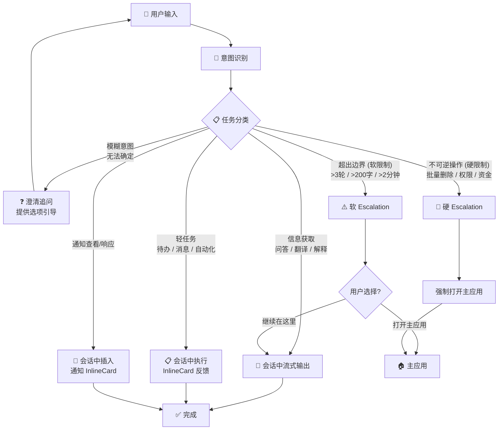

---

## 6. Escalation 完整流程

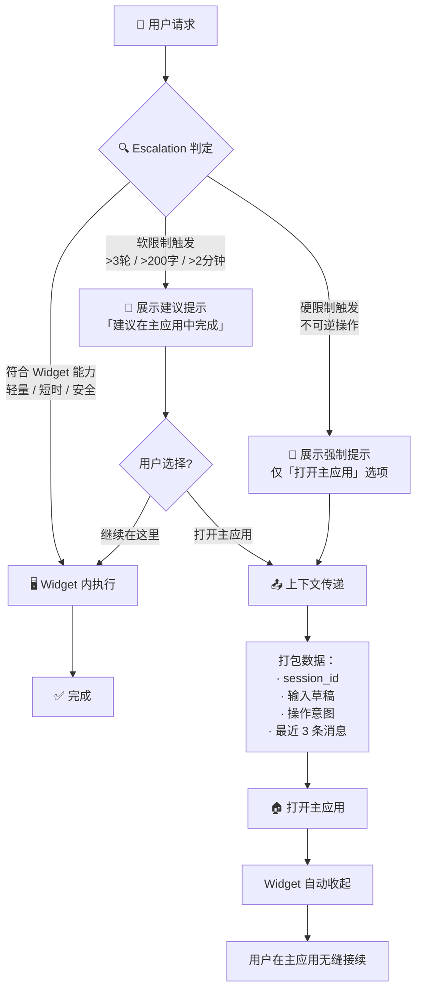

---

## 7. 通知三级策略

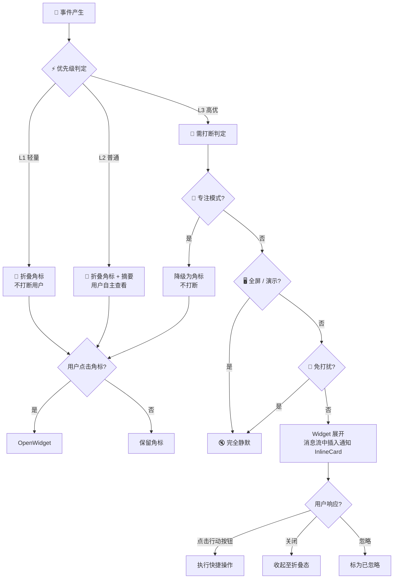

---

## 8. 专注模式行为

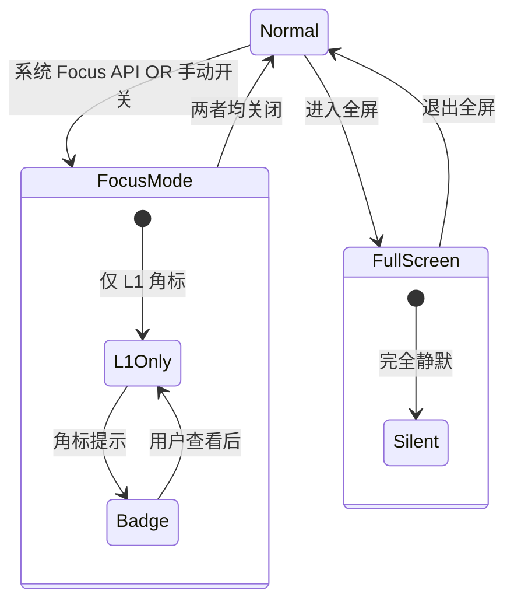

---

## 9. 三层 IA 转换

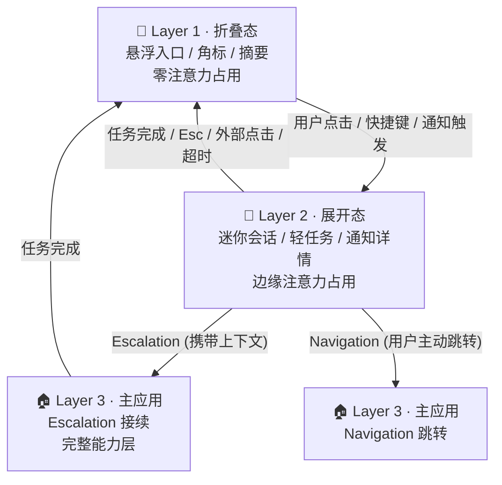

---

## 10. 用户旅程：快速问答（UC-01，核心路径）

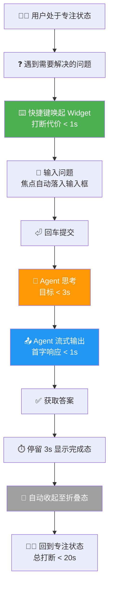

---

## 11. 用户旅程：Escalation 路径（UC-10）

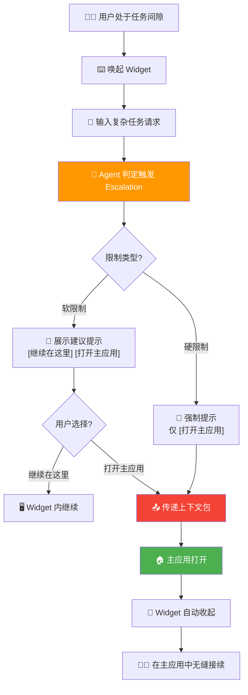

---

## 12. 通知冷却期与存在感矩阵

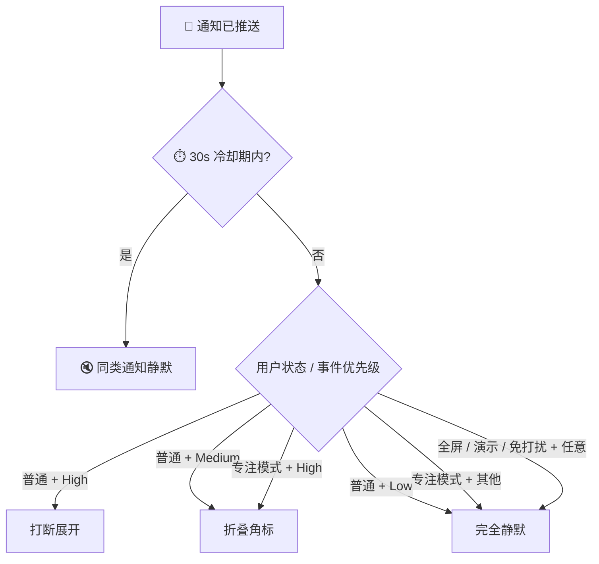

---

## 13. Agent 状态机（技术视角）

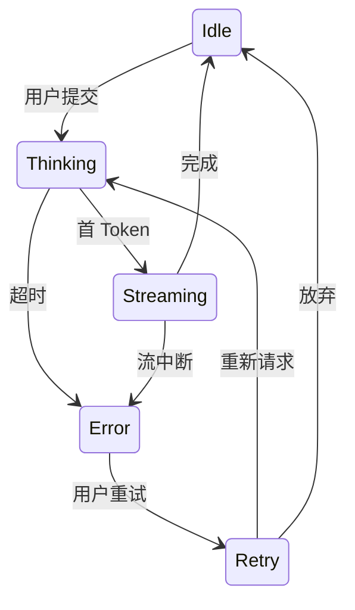

---

## 14. 后台任务流程

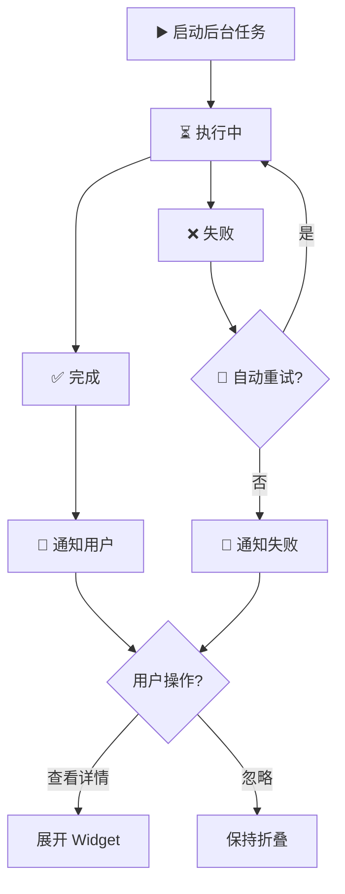

---

## 15. Hover 快捷动作（Copilot 模式）

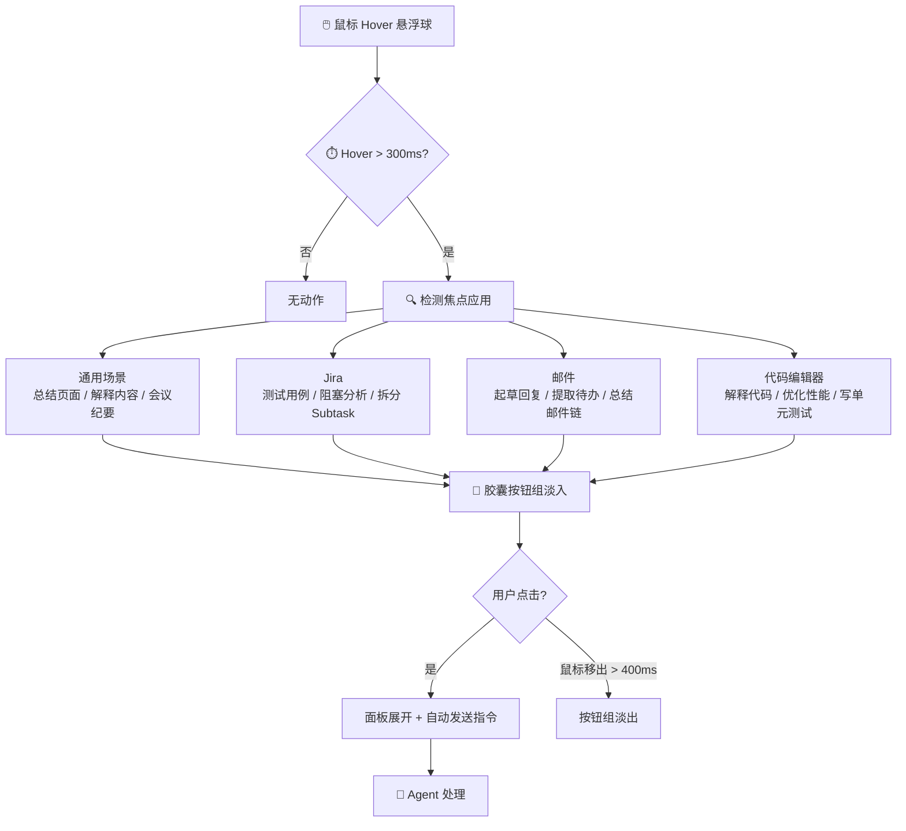

---

> **颜色约定：** 🟢 成功 / 正常 · 🟡 警告 / 思考中 · 🔴 错误 / 硬限制 · 🔵 折叠 / 静默 · ⚪ 中性 / 过渡
